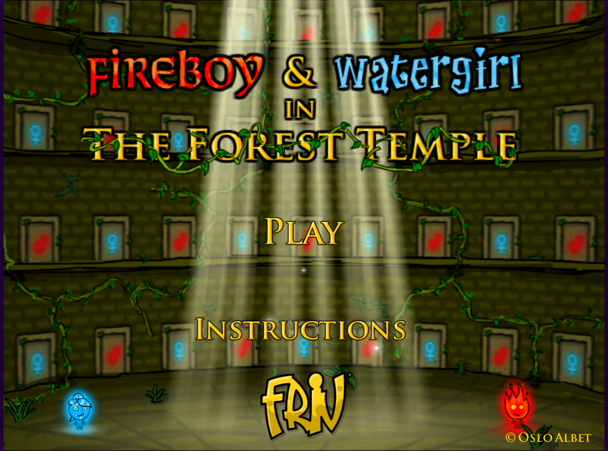
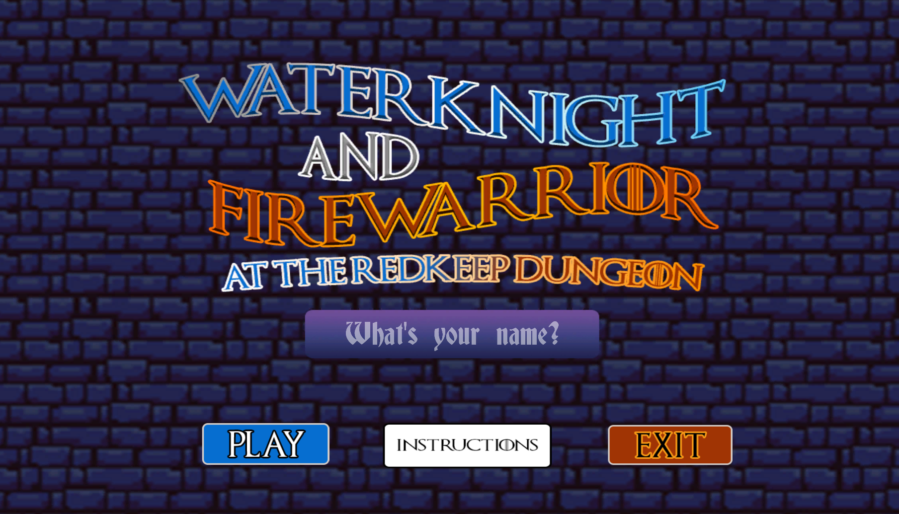
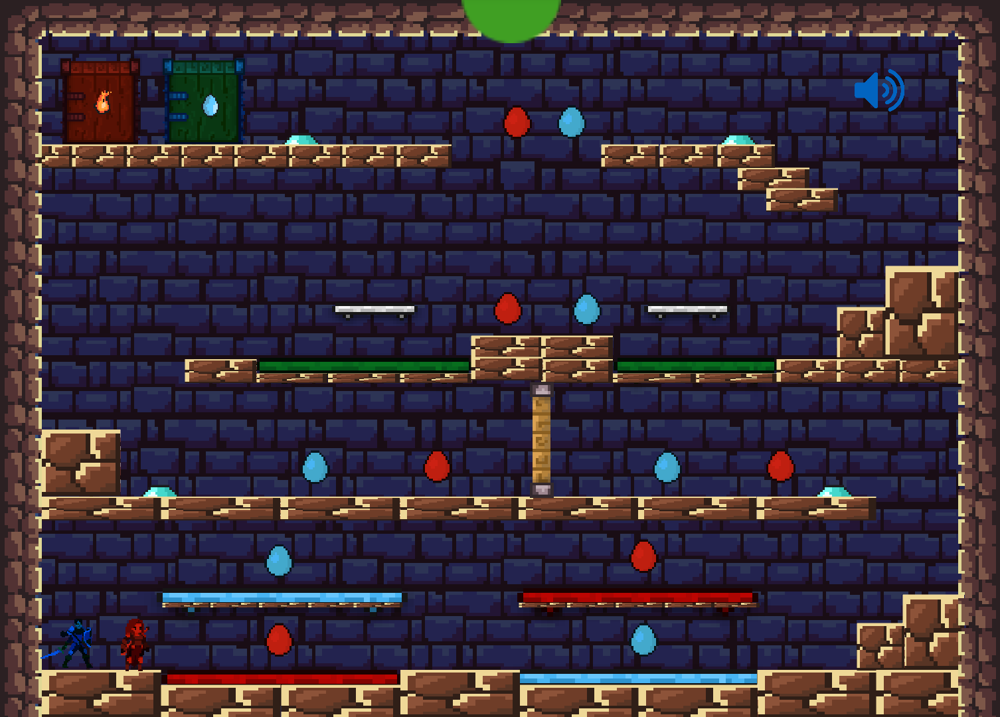
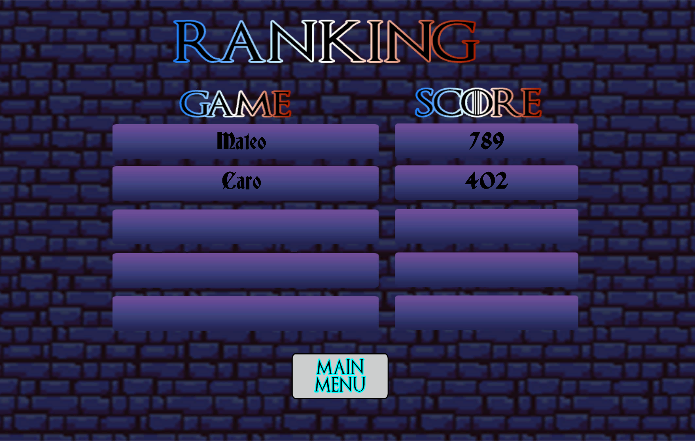

# FireKnight and WaterWarrior

Welcome! Do you want to remember your childhood when you used to pass hours playing games on the internet? Here, you can have those memories again! FireKnight and WaterWarrior is a game inspired one of the most popular games of the old times on the internet, FireBoy and WaterGirl.

In this game, you can control two different players to combine them to pass the different levels and escape from the Redkeep Dungeons, while being careful of the obstacles that you'll find on your path.

| | | 
| :--: | :--: |
|  |  |
| | | 

## Unity Version

2021.3.17f1

## Additional Packages

- Hero Knight - Pixel Art: You can find it at [Unity Asset Store](https://assetstore.unity.com/packages/2d/characters/hero-knight-pixel-art-165188)
- Warrior Free Asset: You can find it at [Unity Asset Store](https://assetstore.unity.com/packages/2d/characters/warrior-free-asset-195707)
- Free 2D Mega Pack: You can find it at [Unity Asset Store](https://assetstore.unity.com/packages/2d/free-2d-mega-pack-177430)

## Visuals of the Game

|  |  |
| :--: | :--: |
|  |  |
|  |  |

## Gameplay Video 

Haven't you decided to playing this game? [Click here!](https://www.youtube.com/watch?v=ncHXUSPru8g)

## Team Members

- Carolina Álvarez Murillo: [caroAM22](https://github.com/caroAM22)
- Alejandro Orozco Ochoa: [brokie636](https://github.com/brokie636)
- Catalina Restrepo Salgado: [CatalinaRpoS](https://github.com/CatalinaRpoS)
- Tomás Rodríguez Taborda: [torodriguezt](https://github.com/torodriguezt)

### Thank you! 
